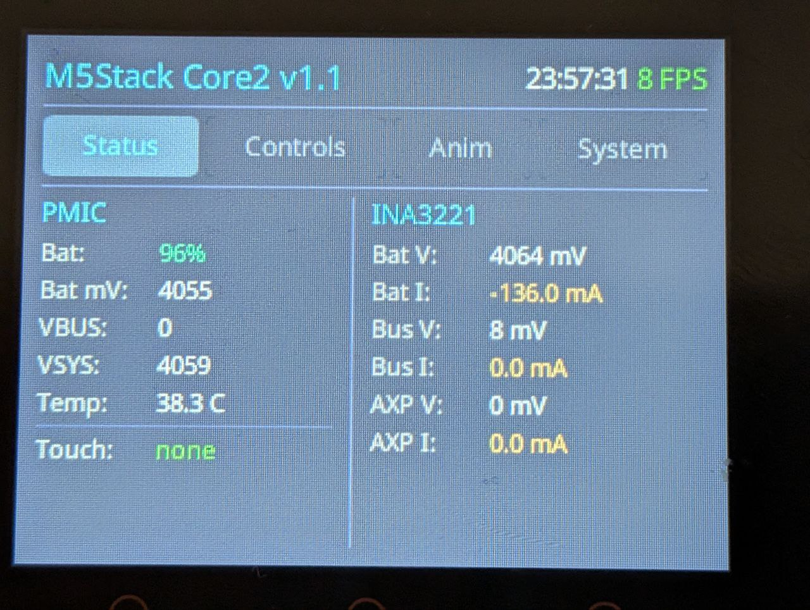
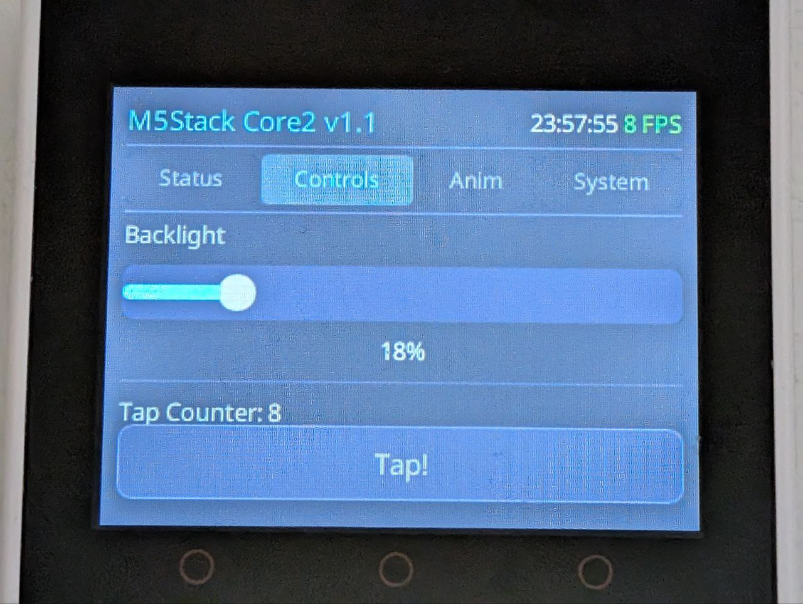
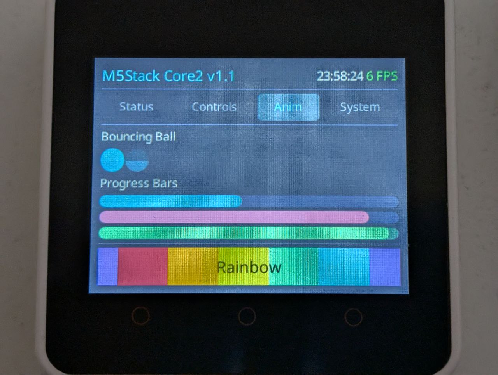
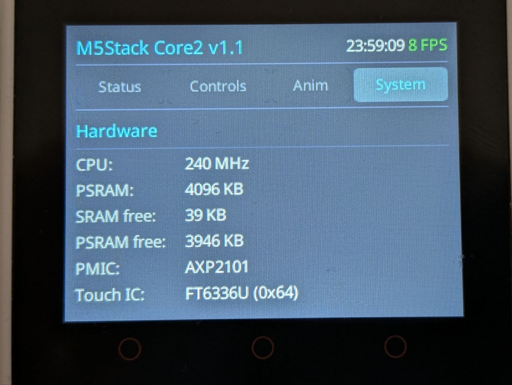
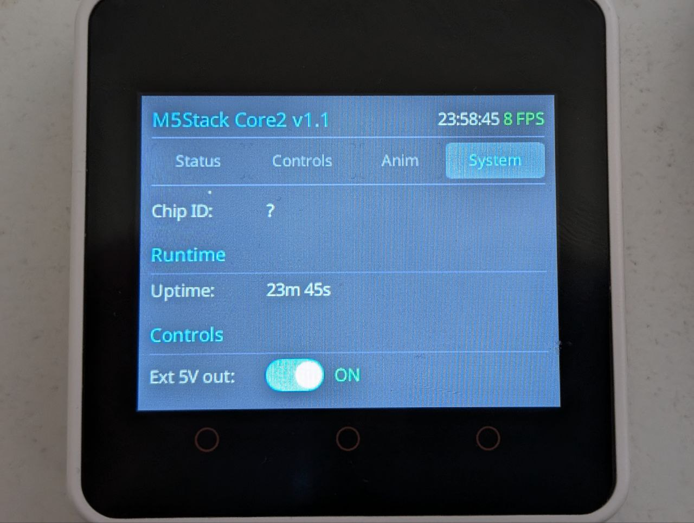

# M5Stack Core2 v1.1 Demo (Rust / esp-hal)

A feature-rich demo application for the [M5Stack Core2 v1.1](https://docs.m5stack.com/en/core/Core2%20v1.1) running bare-metal Rust with [esp-hal](https://github.com/esp-rs/esp-hal) and [Embassy](https://embassy.dev/) async runtime.

## Screenshots

| Status | Controls | Animations |
|--------|----------|------------|
|  |  |  |

| System (hardware) | System (controls) |
|--------------------|--------------------|
|  |  |

## Features

- **Slint UI** with tabbed interface (Status, Controls, Animations, System)
- **ILI9342C display** over SPI + DMA (320x240, 30 MHz) — line-by-line DMA
  streaming with ping-pong tile buffers, so rendering overlaps with SPI
  transmission. No full framebuffer in RAM.
- **Dual-core split** — render loop pinned to core 1 via `esp_rtos::start_second_core`,
  BLE / I2C / touch on core 0. Heavy animation frames can't starve input.
- **FT6336U capacitive touch** with Slint event dispatching
- **AXP2101 PMIC** — battery monitoring, voltage rails, backlight control
- **INA3221** 3-channel power monitor (battery, USB, system rail)
- **BM8563 RTC** with clock display
- **BLE GATT server** (trouble-host) for setting RTC time wirelessly
- **Live stats** — FPS, frame time, render time, heap usage, uptime

## Hardware

| Component | Chip | Interface |
|-----------|------|-----------|
| MCU | ESP32 (240 MHz, 520 KB SRAM, 4 MB PSRAM) | — |
| Display | ILI9342C 320x240 | SPI + DMA |
| Touch | FT6336U | I2C (0x38) |
| PMIC | AXP2101 | I2C (0x34) |
| Power Monitor | INA3221 | I2C (0x40) |
| RTC | BM8563 (PCF8563 compatible) | I2C (0x51) |
| Radio | ESP32 BLE | — |

## Memory Layout

The ESP32 DRAM is split across regions. With BLE enabled, 64 KB is reserved for the Bluetooth controller. PSRAM is not used in this build — line-by-line DMA streaming removes the need for a 150 KB framebuffer:

| Region | Size | Usage |
|--------|------|-------|
| DRAM (main) | 128 KB | BSS (statics, DMA tile buffers, stacks) |
| DRAM2 (reclaimed) | 96 KB | Heap (Slint, BLE, general allocations) |
| PSRAM | 4 MB | unused (init code preserved as comment) |

## Building

Requires the Xtensa Rust toolchain. Install via [espup](https://github.com/esp-rs/espup):

```bash
espup install
```

Build and flash:

```bash
cargo run --release
```

## BLE Time Sync

The device advertises as **"M5Core2"** with a writable GATT characteristic for setting the RTC. A Python script is included:

```bash
uv run scripts/set_time.py
```

This connects via BLE and writes the current system time to the RTC.

## Project Structure

```
src/
  bin/main.rs        — Entry point, peripheral init, core-0 tasks + core-1 spawn
  lib.rs             — Library root
  ble.rs             — BLE GATT server (trouble-host)
  display_dma.rs     — Per-line DMA display driver with ping-pong tile buffers
                       and `LineBufferProvider` for Slint's `render_by_line`
  pmic.rs            — AXP2101 PMIC initialization and helpers
  slint_platform.rs  — Slint platform backend for ESP32
ui/
  main.slint         — Slint UI definition (tabs, widgets, animations)
scripts/
  set_time.py        — Python BLE time sync script (bleak)
```

## Dependencies

Driver crates from crates.io:

- [axp2101-dd](https://crates.io/crates/axp2101-dd) — AXP2101 PMIC driver
- [mipidsi](https://crates.io/crates/mipidsi) — MIPI DSI / ILI9342C init (only used during boot;
  the steady-state render path is the custom DMA driver in `src/display_dma.rs`)
- [ft6336u-dd](https://crates.io/crates/ft6336u-dd) — FT6336U touch driver
- [ina3221-dd](https://crates.io/crates/ina3221-dd) — INA3221 power monitor driver
- [pcf8563-dd](https://crates.io/crates/pcf8563-dd) — PCF8563/BM8563 RTC driver

Git dependencies:

- [trouble-host](https://github.com/embassy-rs/trouble) — BLE GATT host stack (master branch)
- [slint](https://github.com/okhsunrog/slint/tree/rgb565-be) — fork with `Rgb565PixelBE` so
  the software renderer writes big-endian pixels directly for the ILI9342C, avoiding a
  post-render byte swap. Tracks upstream.

esp-hal ecosystem crates are pinned to crates.io releases (esp-hal 1.1.1, esp-rtos 0.3.0,
esp-radio 0.18.0).

## License

MIT OR Apache-2.0
